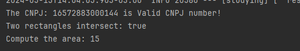
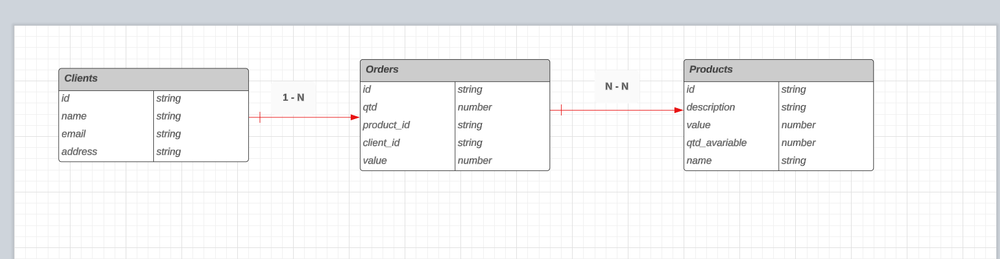
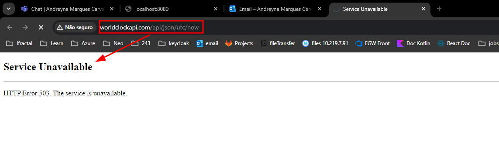

# base-for-kotlin
Studying Kotlin


## How run the Project

### 1- Clone the repository

```bash
  git clone git@github.com:andreyna1808/base-for-kotlin.git
```

Ou...

```bash
  git clone https://github.com/andreyna1808/base-for-kotlin.git
```

# Run the StudyingApplication.kt 


## Challenge 1, 2 and 3



## Entity Relationship Diagram - Simple Order Manager



## About the REST (Challenge 5 and 6)

- Sometimes the URL provided goes offline 



